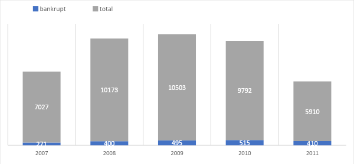
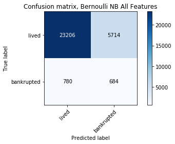
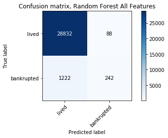
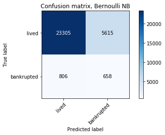
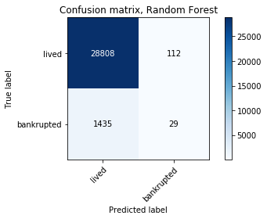
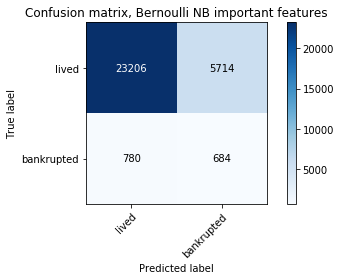
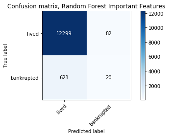
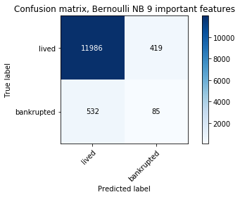

  

# Company Bankruptcy Prediction with Naïve Bayes Algorithm

| Problem	| Methods	| Libs	|
| ---       | ---       | ---   |
| Company Fault Prediction (Multivariate Classification) | Naive Bayes Classifier, Random Forest Classifier | `sklearn`, `matplotlib` |

## Contents

- [Project Description and Goals](#project-description-and-goals)
- [Methodology](#methodology)
- [Experiments](#experiments)
- [Conclusion](#conclusion)
- [References](#references)

Download this study in presentation format [here](./company_fault_pred_pres.pdf)
  

# Project Description and Goals

Due to economic difficulties, companies are facing the risk of bankruptcy. In a financial point of view, predicting if a company will bankrupt can reduce possible waste of precious resources like time and money.

The aim of this project is to develop a prediction model to decide whether a company will bankrupt or not in the following year.

The model to be built should be scalable and fast. Also, the model’s bankruptcy predictions should be at least as good as a Random Forest Classifier.

# Methodology

A dataset containing five years’ data of Polish companies is used. The data was collected from Emerging Markets Information Service (EMIS), which is a database containing information on emerging markets around the world and retrieved from UCI Machine Learning Repository (Tomczak, 2016).

The dataset contains 64 features for each observation. For the period of five years, a total of 43405 observations are available. In this time period, 2091 of the observed companies bankrupted. A summary of bankrupted companies is shown on the Figure below.

Figure 1: Yearly bankruptcy distribution of the dataset

  

As shown on the figure, the data distribution is imbalanced. For each year, the distribution of the data is summarized below.

- Year 2007 has 7.027 observations, 271 of them are bankrupt (4%)
- Year 2008 has 17.200 observations, 400 of them are bankrupt (4%)
- Year 2009 has 27.703 observations, 495 of them are bankrupt (5%)
- Year 2010 has 37.495 observations, 514 of them are bankrupt (5%)
- Year 2011 has 43.405 observations, 410 of them are bankrupt (7%)

The features available in the dataset are presented in the Appendix. There are 64 numerical features for each observation.

A Naïve Bayes classifier is built using the listed features and the binary output variable: bankrupt or not. Python’s Sci-kit Learn library offers four different Naïve Bayes implementations (Sci-kit Learn Developers, 2019). Random Forest Classifier is also available in the Sci-kit Learn library. Naïve Bayes based algorithms are applied to different subsets of features of the dataset. The Random Forest Classifier is used as a benchmark in the experiments.

# Experiments

Firstly, the datasets for five years are merged into a single csv file as input. This dataset is read with Python’s Pandas library “read_csv” function. The missing values in the dataset are filled with zeroes.

Then the training and the test sets are generated by applying Sci-kit Learn library’s StratifiedShuffleSplit function. This function generates random train and test sets while keeping the target label balanced in the sets. The train-test split percentage is set to 70%-30% of the whole dataset, as it is the general approach in machine learning. After this step, randomly selected 30384 observations are in the training set and the remaining 13021 observations make up the test set.

To have an initial understanding of the problem, models are build using the whole feature set with Random Forest, Gaussian NB and Bernoulli NB algorithms. Accuracy, Precision and Recall values, as well as the confusion matrices are considered to evaluate and compare the outputs of the models. Amongst them, Random Forest performed the best. Note that, in this experiment Random Forest classifier correctly classifies only 242 of the 1464 bankruptcy cases; it tends to mark any observation as “no bankruptcy” in general; where on the other hand, Bernoulli NB algorithm tends to mark the outcomes in a more balanced way with a lower accuracy score.

| Naive Bayes | Random Forest |
| --- | --- |
|  | 
| Accuracy: 78.63% | Accuracy: 95.69% |
| Precision: 96.75% | Precision: 95.93% |
| Recall: 80.24% | Recall: 99.70% |

Figure 2: A Comparison of Bernoulli NB and Random Forest algorithms (All 64 features)

Then, another set of models are build using the first 20 features of the dataset. These features are selected based on know-how, as they seemed to be unique and explaining the dataset in a financial point of view. Again, Random Forest is the best performing model. In this experiment, although having a high accuracy score, Random Forest classifier correctly classifies only 29 of the 1464 bankruptcy cases. Again the Bernoulli Naïve Bayes classifier predicts the outcomes more evenly, especially in the bankruptcy case.

| Naive Bayes | Random Forest |
| --- | --- |
|  | 
| Accuracy: 78.87% | Accuracy: 94.91% |
| Precision: 96.66% | Precision: 95.26% |
| Recall: 80.58% | Recall: 99.60% |

Figure 3: A Comparison of Bernoulli NB and Random Forest algorithms (First 20 features)

As another approach, feature importance levels of the 64 input features are considered. The best ranked 20 features are used to build the next set of models. Feature importance scores are imported from the paper of (Zieba, et al., 2016). Importance scores of the first 20 features are presented in the table below.

|#| Feature | Importance Score | 
|---|---|---|
| 1 | X16 | 0.0519 | 
| 2 | X52 | 0.0380 | 
| 3 | X32 | 0.0378| 
| 4 | X28 | 0.0355 | 
| 5 | X5 | 0.0347 | 
| 6 | X40 | 0.0333 | 
| 7 | X9 | 0.0319 | 
| 8 | X11 | 0.0308 | 
| 9 | X59 | 0.0308 | 
| 10 | X23 | 0.0266 | 
| 11 | X25 | 0.0245 | 
| 12 | X55 | 0.0245 | 
| 13 | X17 | 0.0233 | 
| 14 | X14 | 0.0221 | 
| 15 | X29 | 0.0214 | 
| 16 | X13 | 0.0210 | 
| 17 | X58 | 0.0194 | 
| 18 | X30 | 0.0192 | 
| 19 | X57 | 0.0192 | 
| 20 | X56 | 0.0194 | 

Table 1: Importance scores of the most important 20 features

Again, the Random Forest classifier performed the best. But when we consider the confusion matrices, Bernoulli NB has slightly better performance in predicting the bankruptcy outcome.

 | Naive Bayes | Random Forest |
| --- | --- |
|  | 
| Accuracy: 78.63% | Accuracy: 94.60% |
| Precision: 96.75% | Precision: 95.19% |
| Recall: 80.24% | Recall: 99.34% |

Figure 4: A Comparison of Bernoulli NB and Random Forest algorithms (20 most important features)

As the last experiment, a threshold of 0.03 is applied to feature importance scores. A set of models is built based on the remaining top ranked 9 features. As a result, Bernoulli NB algorithm gave the best accuracy score as well as having a slightly better confusion matrix considering the prediction of the bankrupt companies. The final dataset has the features shown in the table below.

  
|# | Feature |
|---|---|
| 1 |  X16 (gross profit + depreciation) / total liabilities | 
| 2 | X52 (short-term liabilities * 365) / cost of products sold) | 
| 3 | X32 (current liabilities * 365) / cost of products sold | 
| 4 | X28 working capital / fixed assets | 
| 5 | X5 ((cash + short-term securities + receivables - short-term liabilities) / (operating expenses - depreciation)) * 365 | 
| 6 | X40 (current assets - inventory - receivables) / short-term liabilities | 
| 7 | X9 sales / total assets | 
| 8 | X11 (gross profit + extraordinary items + financial expenses) / total assets | 
| 9 | X59 long-term liabilities / equity | 

Table 2: Feature names of the most important 9 features, used in the final model

| Naive Bayes | Random Forest |
| --- | --- |
|  | 
| Accuracy: 92.70% | Accuracy: 94.60% |
| Precision: 95.75% | Precision: 95.19% |
| Recall: 96.62% | Recall: 99.34% |

Figure 5: A Comparison of Bernoulli NB and Random Forest algorithms (9 most important features)

# Conclusion

As a result of working with an imbalanced dataset, most classifiers tend to predict the outcome of an observation to be of the majority class. This problem is overcome by selecting a subset of features by their importance scores, then building the model using only these features.

In most of the experiment settings, the Random Forest classifier outperformed the Naïve Bayes based classifiers. Random Forest is a very robust and powerful tool, which fits a number of decision tree classifiers on various sub-samples of the dataset and uses averaging to improve the predictive accuracy and control over-fitting. So, this is an expected result, as the Random Forest based classifiers outperform classical models in other studies as well.

Using a subset of features gave better results than using the whole dataset in the experiments. This is also an expected outcome. Reducing the number of features gives better results in both terms of accuracy and run time in many studies. In the problem of company bankruptcy, reducing the number of features leads to collecting less data from the companies and an easier business process to run the model to decide whether the company will bankrupt in the following year or not.

The final model built has an accuracy score of 92.70%, precision of 95.75% and recall of 96.62%, which are better than any random forest classifier results and satisfies the project goals.

# References

- Sci-kit Learn Developers, 2019. Naive Bayes. (Online)
Available at: https://scikit-learn.org/stable/modules/naive_bayes.html#naive-bayes

- Tomczak, S., 2016. Polish Companies Bankruptcy Dataset. (Online) 
Available at: https://archive.ics.uci.edu/ml/datasets/Polish+companies+bankruptcy+data

- Zieba, M., Tomczak, S. K. & Tomczak, J. M., 2016. Ensemble Boosted Trees with Synthetic Features Generation in Application to Bankruptcy Prediction. Expert Systems with Applications, Volume 58, pp. 93-101.

  

# Appendix: Features of the Dataset

- X1 net profit / total assets
-   X2 total liabilities / total assets
-   X3 working capital / total assets
-   X4 current assets / short-term liabilities
-   X5 [(cash + short-term securities + receivables - short-term liabilities) / (operating expenses - depreciation)] * 365
-   X6 retained earnings / total assets
-   X7 EBIT / total assets 

-   X8 book value of equity / total liabilities
    
-   X9 sales / total assets
    
-   X10 equity / total assets
    
-   X11 (gross profit + extraordinary items + financial expenses) / total assets
    
-   X12 gross profit / short-term liabilities
    
-   X13 (gross profit + depreciation) / sales
    
-   X14 (gross profit + interest) / total assets
    
-   X15 (total liabilities * 365) / (gross profit + depreciation)
    
-   X16 (gross profit + depreciation) / total liabilities
    
-   X17 total assets / total liabilities
    
-   X18 gross profit / total assets
    
-   X19 gross profit / sales
    
-   X20 (inventory * 365) / sales
    
-   X21 sales (n) / sales (n-1)
    
-   X22 profit on operating activities / total assets
    
-   X23 net profit / sales
    
-   X24 gross profit (in 3 years) / total assets
    
-   X25 (equity - share capital) / total assets
    
-   X26 (net profit + depreciation) / total liabilities
    
-   X27 profit on operating activities / financial expenses
    
-   X28 working capital / fixed assets
    
-   X29 logarithm of total assets
    
-   X30 (total liabilities - cash) / sales
    
-   X31 (gross profit + interest) / sales
    
-   X32 (current liabilities * 365) / cost of products sold
    
-   X33 operating expenses / short-term liabilities
    
-   X34 operating expenses / total liabilities
    
-   X35 profit on sales / total assets
    
-   X36 total sales / total assets
    
-   X37 (current assets - inventories) / long-term liabilities
    
-   X38 constant capital / total assets
    
-   X39 profit on sales / sales
    
-   X40 (current assets - inventory - receivables) / short-term liabilities
    
-   X41 total liabilities / ((profit on operating activities + depreciation) * (12/365))
    
-   X42 profit on operating activities / sales
    
-   X43 rotation receivables + inventory turnover in days
    
-   X44 (receivables * 365) / sales
    
-   X45 net profit / inventory
    
-   X46 (current assets - inventory) / short-term liabilities
    
-   X47 (inventory * 365) / cost of products sold
    
-   X48 EBITDA (profit on operating activities - depreciation) / total assets
    
-   X49 EBITDA (profit on operating activities - depreciation) / sales
    
-   X50 current assets / total liabilities
    
-   X51 short-term liabilities / total assets
    
-   X52 (short-term liabilities * 365) / cost of products sold)
    
-   X53 equity / fixed assets
    
-   X54 constant capital / fixed assets
    
-   X55 working capital
    
-   X56 (sales - cost of products sold) / sales
    
-   X57 (current assets - inventory - short-term liabilities) / (sales - gross profit - depreciation)
    
-   X58 total costs /total sales
    
-   X59 long-term liabilities / equity
    
-   X60 sales / inventory
    
-   X61 sales / receivables
    
-   X62 (short-term liabilities *365) / sales
    
-   X63 sales / short-term liabilities
    
-   X64 sales / fixed assets
